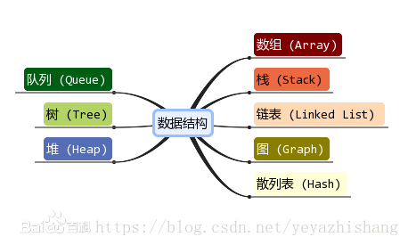

# 数据结构分类
数据结构是指相互之间存在着一种或多种关系的数据元素的集合和该集合中数据元素之间的关系组成 。
常用的数据结构有：数组，栈，链表，队列，树，图，堆，散列表等   

# 数组和链表的区别

**从逻辑结构上来看:**  
数组必须实现定于固定的长度，不能适应数据动态增减的情况，即数组的大小一旦定义就不能改变。当数据增加是，可能超过原先定义的元素的个数；当数据减少时，造成内存浪费；  
链表动态进行存储分配，可以适应数据动态地增减的情况，且可以方便地插入、删除数据项。   
**从内存存储的角度看:**
数组从栈中分配空间（用new则在堆上创建），对程序员方便快速，但是自由度小；   
链表从堆中分配空间，自由度大但是申请管理比较麻烦。  
**从访问方式类看:**  
数组在内存中是连续的存储，因此可以利用下标索引进行访问；   
链表是链式存储结构，在访问元素时候只能够通过线性方式由前到后顺序的访问，所以访问效率比数组要低。     

数组的优点：随机访问性强、查找速度快  
数组的缺点：插入和删除效率低、可能浪费内存、内存空间要求高，必须有足够的连续内存空间。数组大小固定，不能动态拓展  
链表的优点：插入删除速度快、内存利用率高，不会浪费内存、大小没有固定，拓展很灵活。  
链表的缺点：不能随机查找，必须从第一个开始遍历，查找效率低  
-      数组    链表
- 读取    O(1)    O(n)  
- 插入    O(n)    O(1)  
- 删除    O(n)    O(1)  

# 栈、队列和线性表：可采用顺序存储和链式存储的方法进行存储

顺序存储：借助数据元素在存储空间中的相对位置来表示元素之间的逻辑关系

链式存储：借助表示数据元素存储地址的指针表示元素之间的逻辑关系

## 栈和队列用什么结构存储？ 
链式存储结构  
顺序存储结构  

# 线性表两种存储结构的比较：

　顺序表：

　优点：在顺序表中，逻辑中相邻的两个元素在物理位置上也相邻，查找比较方便，存取任一元素的时间复杂度都为O(1)

　缺点：不适合在任意位置插入、删除元素，因为需要移动元素，平均时间复杂度为O(n)

　链表：

　优点：在链接的任意位置插入或删除元素只需修改相应指针，不需要移动元素；按需动态分配，不需要按最大需求预先分配一块连续空空

　缺点：查找不方便，查找某一元素需要从头指针出发沿指针域查找，因此平均时间复杂度为O(n)

# 单向循环链表判断为空的条件       
## 带头节点
单链表：　     head->next = None  
单向循环列表：  head->next = head  

## 不带头节点
单链表：       head = None  
单向循环列表：  head = None  

# 链表和循环链表的优点

链表是在插入和删除的时候，不需要移动元素，但是不能随机查找到对应的元素。而循环链表的优点在于从任何一个点访问链表都可以访问完全部表。  

# **排序算法**
## １．稳定性
在待排序的数据中，存在多个相同的数据，经过排序之后，他们的对相对顺序依旧保持不变，实际上就是说array[i]=array[j],i<j.
就是array[i]在array[j]之前，那么经过排序之后array[i]依旧在array[j]之前，那么这个排序算法稳定，否则，这个排序算法不稳定

## **不稳定原因：**
选择排序：
在一趟选择，如果当前元素比一个元素小，而该小的元素又出现在一个和当前元素相等 的元素后面，那么交换后稳定性就被破坏了。
举个例子，序列5 8 5 2 9， 我们知道第一遍选择第1个元素5会和2交换，那么原序列中2个5的相对前后顺序就被破坏了，所以选择排序不是一个稳定的排序算法

快速排序：　　
待排数组 6 9 9 10 11
我们选择第一个9作为主元（过程是随机的），若把小于等于放在主元的左边，则第二个9就跑到第一个9左面了，从而导致不稳定
主元的选择是随机的，导致不稳定的原因在于我们无法保证每次都是稳定的，所以它是不稳定的。

希尔排序：　　
希尔排序是按照不同步长对元素进行插入排序，一次插入排序是稳定的，不会改变相同元素的相对顺序，但在不同的插入排序过程中，相同的元素可能在各自的插入排序中移动，稳定性就会被破坏，所以希尔排序不稳定。

# 插入排序介绍，时间复杂度，是否稳定，有哪些不稳定算法

将数组的第一个数认为是有序数组，从后往前（从前往后）扫描该有序数组，把数组中其余n-1个数，根据数值的大小，插入到有序数组中，直至数组中的所有数有序排列为止。这样的话，n个元素需要进行n-1趟排序！！！
它的工作原理是通过构建有序序列，对于未排序数据，在已排序序列中从后向前扫描，找到相应位置并插入。插入排序在实现上，在从后向前扫描过程中，需要反复把已排序元素逐步向后挪位，为最新元素提供插入空间。

# 希尔排序。 
（1）对于n个待排序的数列，取一个小于n的整数gap(gap被称为步长)将待排序元素分成若干个组子序列，所有距离为gap的倍数的记录放在同一个组中；然后，对各组内的元素进行直接插入排序。 这一趟排序完成之后，每一个组的元素都是有序的。然后减小gap的值，并重复执行上述的分组和排序。重复这样的操作，当gap=1时，整个数列就是有序的。
（2）由于开始时，increment的取值较大，每个子序列中的元素较少，排序速度较快，到排序后期increment取值逐渐变小，子序列中元素个数逐渐增多，但由于前面工作的基础，大多数元素已经基本有序，所以排序速度仍然很快。

# 简述快速排序过程

1）选择一个基准元素,通常选择第一个元素或者最后一个元素。　　

2）通过一趟排序将待排序的记录分割成独立的两部分，其中一部分记录的元素值均比基准元素值小。另一部分记录的元素值比基准值大。　　

3）此时基准元素在其排好序后的正确位置。　　

4）然后分别对这两部分记录用同样的方法继续进行排序，直到整个序列有序。 　

# 哪些排序算法在一次遍历之后可以得到最大的元素 
冒泡排序；　　
选择排序；

# 稳定的排序有哪些?

冒泡排序；插入排序；归并排序               

# 选择排序算法准则：

一般而言，需要考虑的因素有以下四点：

设待排序元素的个数为n.

1. 当n较大，则应采用时间复杂度为O(nlog2n)的排序方法：快速排序、堆排序或归并排序序。

2. 当n较大，内存空间允许，且要求稳定性：归并排序

3. 当n较小，可采用直接插入或直接选择排序。  
　　直接插入排序：当元素分布有序，直接插入排序将大大减少比较次数和移动记录的次数。  
　　直接选择排序 ：元素分布有序，如果不要求稳定性，选择直接选择排序

4. 一般不使用或不直接使用传统的冒泡排序。

5. 基数排序
它是一种稳定的排序算法，但有一定的局限性：  
　　1、关键字可分解。  
　　2、记录的关键字位数较少，如果密集更好  
　　3、如果是数字时，最好是无符号的  

# 如何建立一个大根堆

# **树**
**二叉树**：每个节点最多含有两个子树的树称为二叉树；
**节点的度**：一个节点含有的子树的个数称为该节点的度；
**树的度**：一棵树中，最大的节点的度称为树的度；

# 树的存储与表示
顺序存储：将数据结构存储在固定的数组中，然在遍历速度上有一定的优势，但因所占空间比较大，是非主流二叉树。
二叉树通常以链式存储。

# 二叉树和度为2的树的区别

1. 度为 2 的树要求每个节点最多只能有两棵子树，并且至少有一个节点有两棵子树; 二叉树的度可以为0,1和2;
2. 二叉树的子树有左子树和右子树的区别，而度为2的树的子树左右没有分别。  --无序

# 讲讲hash和红黑树,哪个效率高,hash怎么实现的
区别：
1. 红黑树是有序的，Hash是无序的，根据需求来选择。
2. 红黑树占用的内存更小（仅需要为其存在的节点分配内存），而Hash事先应该分配足够的内存存储散列表,即使有些槽可能弃用
3. 红黑树查找和删除的时间复杂度都是O(logn)，Hash查找和删除的时间复杂度都是O(1)。

散列冲突怎么处理？    

讲讲hashmap底层

hash怎么实现的 

哈夫曼树