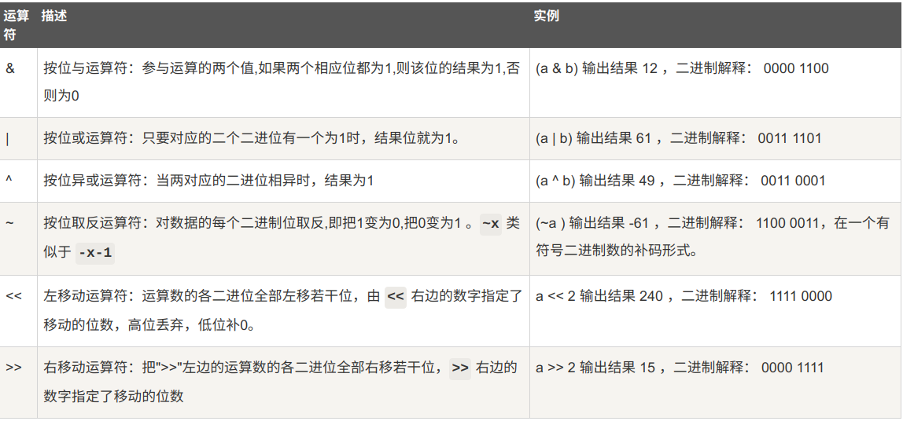

# Python算术运算符
## 除法 
> Python2.x 里，整数除整数，只能得出整数。如果要得到小数部分，把其中一个数改成浮点数即可。
>>> 1/2  
0
>>> 1.0/2  
0.5
>>> 1/float(2)  
0.5

## 幂
**	幂 - 返回x的y次幂 -- x**y

# Python比较运算符
!=	不等于 - 
<>	不等于 - python3 已废弃。


# Python位运算符
按位运算符是把数字看作二进制来进行计算的。  
 

```javascript
#!/usr/bin/python
# -*- coding: UTF-8 -*-
 
a = 60            # 60 = 0011 1100 
b = 13            # 13 = 0000 1101 
c = 0
 
c = a & b;        # 12 = 0000 1100
print "1 - c 的值为：", c
 
c = a | b;        # 61 = 0011 1101 
print "2 - c 的值为：", c
 
c = a ^ b;        # 49 = 0011 0001
print "3 - c 的值为：", c
 
c = ~a;           # -61 = 1100 0011
print "4 - c 的值为：", c
 
c = a << 2;       # 240 = 1111 0000
print "5 - c 的值为：", c
 
c = a >> 2;       # 15 = 0000 1111
print "6 - c 的值为：", c

```

# Python成员运算符
除了以上的一些运算符之外，Python还支持成员运算符，测试实例中包含了一系列的员，包括字符串，列表或元组。

> in	如果在指定的序列中找到值返回 True，否则返回 False。	x 在 y 序列中 , 如果 x 在 y 序列中返回 True。  
> not in	如果在指定的序列中没有找到值返回 True，否则返回 False。	x 不在 y 序列中 , 如果 x 不在 y 序列中返回 True。

```javascript
a = 5
list1 = [1, 2, 3, 4, 5 ]

if a in list1:
    print(11111111)

```

