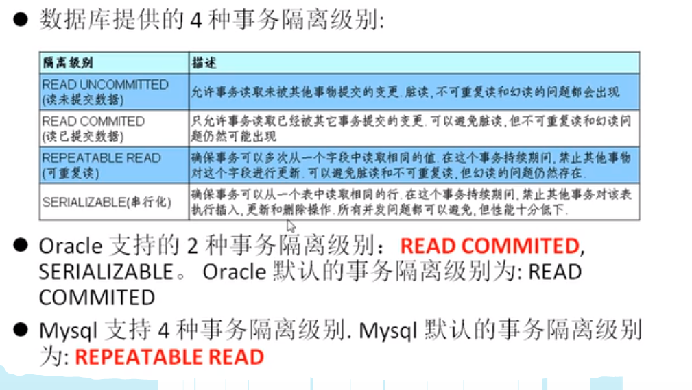

[目录]
# 数据库的好处
1. 持久化数据到本地
2. 可以实现结构化查询，方便管理

# 数据库相关概念
1. DB: 数据库，保存一组有组织的数据的容器；
2. DBMS:数据库管理系统，又称为数据库软件，用于管理DB中的数据；
3. SQL:结构化查询语言， 用于和DBMS通信的语言；

# 数据库存储数据的特点
1. 将数据放到表中，表再放到库中
2. 一个数据库中可以有多个表，每个表都有一个的名字，用来标识自己。表名具有唯一性。
3. 表具有一些特性，这些特性定义了数据在表中如何存储，类似java中 “类”的设计。
4. 表由列组成，我们也称为**字段**。所有表都是由一个或多个列组成的，每一列类似java 中的”属性”
5. 表中的数据是按行存储的，每一行类似于java中的“对象”。

## 常见的数据库管理系统
MySQL  
Oracle  
db2  
sqlserver  

# MySQL的常见命令 

1. 查看当前所有的数据库  
show databases;

2. 打开指定的库  
use 库名

3. 查看当前库   
select daabase();

4. 查看当前库的所有表  
show tables;

5. 查看其它库的所有表  
show tables from 库名;

6. 创建表  
create table 表名(  
   列名 列类型,  
   列名 列类型，  
   。。。  
);  

7. 查看表结构  
desc 表名;

8. 查看服务器的版本  
方式一：登录到mysql服务端  
select version();  
方式二：没有登录到mysql服务端  
mysql --version  
或  
mysql --V  

# MySQL的语法规范
1. 不区分大小写,但建议关键字大写，表名、列名小写
2. 每条命令最好用分号结尾
3. 每条命令根据需要，可以进行缩进 或换行
4. 注释  
   单行注释：#注释文字  
   单行注释：-- 注释文字  
   多行注释：/* 注释文字  */  

# 编程语言：SQL(structure query language) - 结构化查询语言
   1. DDL(data definition language)   - 数据定义语言 - create / drop / alter
   2. DML(data manipulation language) - 数据操作语言 - insert / delete / update / select    增删改查
   3. DCL(data control language)      - 数据控制语言 - grant / revoke                (赋予用户权限/(收回权限）
 

登陆：
mysql [-h主机名 -P端口号] -u 用户名 -p密码
mysql -u root -p

密码

# 事务
**定义：**
事务是一组SQL语句，要么全部执行成功，要么全部执行失败。通常一个事务对应一个完整的业务(例如银行账户转账业务，该业务就是一个最小的工作单元)

**持久性**：事务处理结束后，对数据的修改就是永久的，即便系统故障也不会丢失。
原子性（Atomicity）：一个事务是不可再分割的工作单位，要么都执行要么都不执行
一致性（Consistency）：一个事务执行会使数据从一个一致状态切换到另外一个一致状态,在事务开始之前和事务结束以后，数据库的完整性没有被破坏。
隔离性（）：一个事务的执行不受其他事务的干扰
持久性（）：一个事务一旦提交，则会永久的改变数据库的数据.

**-事务控制语句：**
begin 或 start transaction 显式地开启一个事务；

commit 也可以使用 commt work，不过二者是等价的。COMMIT 会提交事务，并使已对数据库进行的所有修改成为永久性的；

rollback 也可以使用 rollback work，不过二者是等价的。回滚会结束用户的事务，并撤销正在进行的所有未提交的修改；

savepoint identifier，savepoint 允许在事务中创建一个保存点，一个事务中可以有多个 savepoint;

release savepoint identifier 删除一个事务的保存点，当没有指定的保存点时，执行该语句会抛出一个异常；

rollback to identifier 把事务回滚到标记点；

set transaction 用来设置事务的隔离级别。

**-使用保留点 SAVEPOINT**

savepoint 是在数据库事务处理中实现“子事务”（subtransaction），也称为嵌套事务的方法。事务可以回滚到 savepoint 而不影响 savepoint 创建前的变化, 不需要放弃整个事务。

ROLLBACK 回滚的用法可以设置保留点 SAVEPOINT，执行多条操作时，回滚到想要的那条语句之前。

演示savepoint 的使用
SET autocommit=0;
START TRANSACTION;
DELETE FROM account WHERE id=25;
SAVEPOINT a;#设置保存点
DELETE FROM account WHERE id=28;
ROLLBACK TO a;#回滚到保存点

## 三种错误读：
**脏读**：一个事务在读数据，读到了另一个还没有提交的修改，如果另一个事务进行了回滚，那么也就读到了脏数据
**不可重复读**：读到是是最新的数据，但是一个事务中如果多次读取，可能每次读到的数据不一致
**幻读**: 无法保证每次读取的行数量一致，因为其它事务插入无法阻止

               脏读	不可重复读	幻读       
read uncommitted：√     √       √  
read committed：  ×     √       √  
repeatable read： ×     ×       √  
serializable	  ×     ×       ×  
√：可能出现　　　×：不可能出现

mysql中默认 第三个隔离级别 repeatable read  
oracle中默认第二个隔离级别 read committed  

**查看隔离级别**
select @@tx_isolation;
**设置隔离级别**
set session/global transaction isolation level 隔离级别;

## ？？？？
1、处理效率：drop>truncate>delete

# 存储过程

存储过程（Stored Procedure）是一种在数据库中存储复杂程序，以便外部程序调用的一种数据库对象。
存储过程是为了完成特定功能的SQL语句集，经编译创建并保存在数据库中，用户可通过指定存储过程的名字并给定参数(需要时)来调用执行。
存储过程思想上很简单，就是数据库 SQL 语言层面的代码封装与重用。

优点：
   存储过程可封装，并隐藏复杂的商业逻辑。
   存储过程可以回传值，并可以接受参数。
   存储过程无法使用 SELECT 指令来运行，因为它是子程序，与查看表，数据表或用户定义函数不同。
   存储过程可以用在数据检验，强制实行商业逻辑等。
缺点：
   存储过程，往往定制化于特定的数据库上，因为支持的编程语言不同。当切换到其他厂商的数据库系统时，需要重写原有的存储过程。
   存储过程的性能调校与撰写，受限于各种数据库系统。

# 视图

# 查询

## 基础查询
写法顺序：select--from--where--group by--having--order by 
执行顺序：from--where--group by--having--select--order by
就是select要放后面，如果有order by，则order by放最后，因为order by 是对结果进行排序
换句话说：
1.拿着where指定的约束条件，去文件/表中取出一条条记录
2.将取出的一条条记录进行分组group by，如果没有group by，则整体作为一组
3.将分组的结果进行having过滤

-- 分组以前的筛选使用where = 指定行所对应的条件
-- 分组以后的筛选使用having = 指定组所对应的条件
-- where不能接聚合函数，因为查询还没有结果，不能用结果对条件进行过滤

###  查询学生选课的所有日期（去重）
select distinct scdate from tb_score;

### 聚合函数
-- 聚合函数： max/min/count/sum/avg

### case
case when <pred> then <result> ... else <result>  end  是一个组合。
eg: select stuname , case stusex when 1 then '男' else '女' end   as 性别 from tb_student;  

## 连接查询

含义：又称多表查询，当查询的字段来自于多个表时，就会用到连接查询

笛卡尔乘积现象：表1 有m行，表2有n行，结果=m*n行

发生原因：没有有效的连接条件
如何避免：添加有效的连接条件

分类：
	按年代分类：
	sql92标准:仅仅支持内连接
	sql99标准【推荐】：支持内连接+外连接（左外和右外）+交叉连接
	
	按功能分类：
		内连接：
			等值连接
			非等值连接
			自连接
		外连接：
			左外连接
			右外连接
			全外连接
		
		交叉连接

## sql99语法
语法：
	select 查询列表
	from 表1 别名 【连接类型】
	join 表2 别名 
	on 连接条件
	【where 筛选条件】
	【group by 分组】
	【having 筛选条件】
	【order by 排序列表】

分类：
内连接（★）：inner
外连接
	左外(★):left 【outer】
	右外(★)：right 【outer】
	全外：full【outer】
交叉连接：cross 

# 索引

