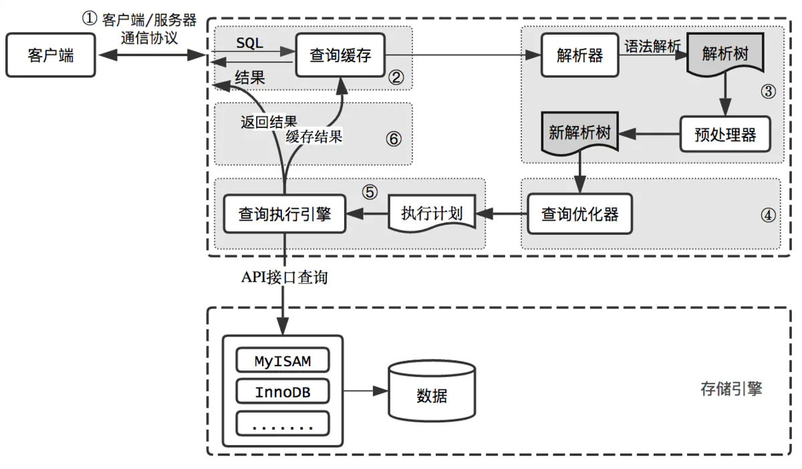

# 
## MySql的逻辑架构

>和其它数据库相比，MySQL有点与众不同，它的架构可以在多种不同场景中应用并发挥良好作用。主要体现在存储引擎的架构上，插件式的存储引擎架构将查询处理和其它的系统任务以及数据的存储提取相分离。这种架构可以根据业务的需求和实际需要选择合适的存储引擎。

# 1.1 连接层

1. 每个客户端的连接都对应着服务器上的一个线程。服务器上维护了一个线程池，避免为每个连接都创建销毁一个线程。
2. 当客户端连接到MySQL服务器时，服务器对其进行认证。可以通过用户名和密码的方式进行认证，也可以通过SSL证书进行认证。
3. 登录认证通过后，服务器还会验证该客户端是否有执行某个查询的权限。

# 1.2 服务层
第二层负责解析查询(编译SQL)，并对其进行优化(如调整表的读取顺序，选择合适的索引等)。对于SELECT语句，在解析查询前，服务器会先检查查询缓存，如果能在其中找到对应的查询结果，则无需再进行查询解析、优化等过程，直接返回查询结果。存储过程、触发器、视图等都在这一层实现。

# 1.3.引擎层
第三层是存储引擎，存储引擎负责在MySQL中存储数据、提取数据、开启一个事务等等。存储引擎通过API与上层进行通信，这些API屏蔽了不同存储引擎之间的差异，使得这些差异对上层查询过程透明。存储引擎不会去解析SQL

# 1.4.存储层


### MySQL查询过程


 ``` 
1. 客户端/服务器通信协议：  
在任一时刻， 要么是服务器向客户端发送数据，要么是客户端向服务器发送数据，这两个动作不能同时发生。  
一旦一端开始发送消息，另一端要接收完整个消息才能响应它。  
服务端响应客户端请求时，客户端必须接收整个返回结果。因此在实际开发中，应该尽量保持查询简单且只返回必须的数据，这也是查询中尽量避免使用 `SELECT *` 和 `LIMIT` 的原因之一。

2. 查询缓存  
- 在查询缓存打开的情况下，解析一个查询语句的时候，MySQL会先检查这个查询缓存是否命中查询缓存中的数据。如果当前查询恰好命中查询缓存，在检查用户权限之后，会直接返回缓存中的结果，这种情况下查询不会被解析，不会生成执行计划，更不会执行。  
- MySQL将缓存存放在一个引用表（类似于HashMap的数据结构），通过一个哈希值索引，这个哈希值通过查询本身、当前要查询的数据库、客户端协议版本号等一些可能影响结果的信息计算得来。所以两个查询在任何字符上的不同（例如：空格、注释），都会导致缓存不会命中。  
- 如果查询中包含任何用户自定义函数、存储函数、用户变量、临时表、mysql库中的系统表，其查询结果都不会被缓存。因为同一个函数调用返回的结果可能不同(如 `NOW()` `CURRENT_USER`等)，这样的查询结果缓存起来没有意义。
- 是缓存，就会失效，那查询缓存何时失效呢？  
MySQL的查询缓存系统会跟踪查询中涉及的每个表，如果这些表（数据或结构）发生变化，那么和这张表相关的所有缓存数据都将失效。正因为如此，在任何的写操作时，MySQL必须将对应表的所有缓存都设置为失效。如果查询缓存非常大或者碎片很多，这个操作就可能带来很大的系统消耗。除了写操作，读操作也会造成系统消耗：  
    1. 任何的查询语句在开始之前都必须经过检查，即使这条SQL语句永远不会命中缓存
    2. 如果查询结果可以被缓存，那么执行完成后，会将结果存入缓存，也会带来额外的系统消耗  

    基于此，我们要知道并不是什么情况下查询缓存都会提高系统性能，缓存和失效都会带来额外消耗，只有当缓存带来的资源节约大于其本身消耗的资源时，才会给系统带来性能提升。

- 如果系统确实存在一些性能问题，可以尝试打开查询缓存，并在数据库设计上做一些优化，比如：

    - 用多个小表代替一个大表，注意不要过度设计
    - 批量插入代替循环单条插入
    - 合理控制缓存空间大小，一般来说其大小设置为几十兆比较合适
    - 可以通过SQL_CACHE和SQL_NO_CACHE来控制某个查询语句是否需要进行缓存
 ``` 


## 存储引擎


# 索引优化分析
##　join图
语法：
	select 查询列表
	from 表1 别名 【连接类型】
	join 表2 别名 
	on 连接条件
	【where 筛选条件】
	【group by 分组】
	【having 筛选条件】
	【order by 排序列表】
	

分类：
内连接（★）：[inner]
外连接
	左外(★):left 【outer】
	右外(★)：right 【outer】
	全外：full【outer】
交叉连接：cross 


# 索引
补充：b树与b+树的区别？
https://blog.csdn.net/weixin_42228338/article/details/97684517
