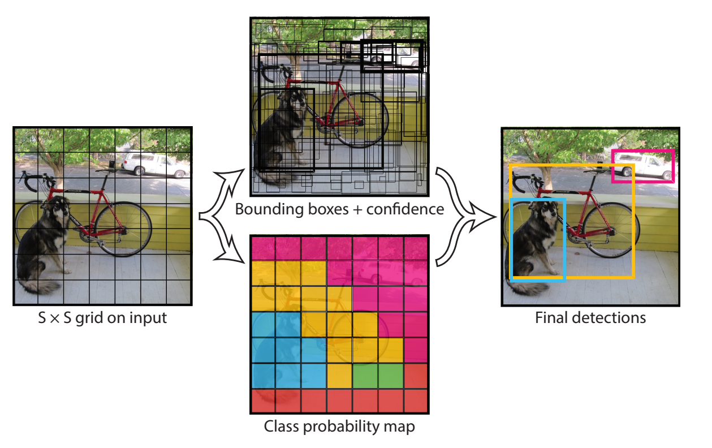
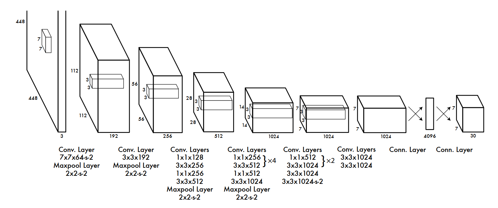
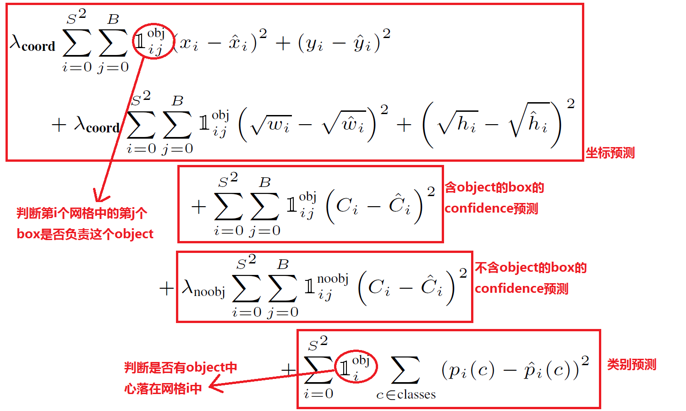

# Yolo v1 的核心思想
1. Prior work on object detection repurposes classifiers to perform detection. Instead, we frame object detection as a regression problem to spatially separated bounding boxes and associated class probabilities.
2. A single neural network predicts bounding boxes and class probabilities directly from full images in one evaluation.

# 检测方法

● 将一幅图像分成SxS个网格(grid cell)，如果某个object的中心 落在这个网格中，则这个网格就负责预测这个object。  
  
● 每个网格要预测B个bounding box，每个 bounding box除了要回归自身的位置之外，还要附带预测一个confidence值。这个confidence代表了所预测的box中含有object的置信度和这个box预测的有多准两重信息，其值是这样计算的：Pr(Object) ∗ IOU(truth pred).

其中如果有object落在一个grid cell里，第一项取1，否则取0。 第二项是预测的bounding box和实际的groundtruth之间的IoU值。

● 每个bounding box要预测(x, y, w, h)和confidence共5个值，每个网格还要预测一个类别信息，记为C类。则SxS个网格，每个网格要预测B个bounding box还要预测C个categories。输出就是S x S x (5*B+C)的一个tensor。  

**注意:** class信息是针对每个网格的，confidence信息是针对每个bounding box的。

**举例说明:** 在PASCAL VOC中，图像输入为448x448，取S=7，B=2，一共有20个类别(C=20)。则输出就是7x7x30的一个tensor。

● 在**test**的时候，每个网格预测的class信息和bounding box预测的confidence信息相乘，就得到每个bounding box的class-specific confidence score:  
得到每个box的class-specific confidence score以后，设置阈值，滤掉得分低的boxes，对保留的boxes进行NMS处理，就得到最终的检测结果。

**文章里的图错了！！！！！！！！！**  
**注：**  
由于输出层为全连接层，因此在检测时，YOLO训练模型只支持与训练图像相同的输入分辨率。
Our detection network has 24 convolutional layers followed by 2 fully connected layers.

● 最后一层预测网络的分类和边框结果：
其中坐标的x,y用对应网格的offset归一化到0-1之间，w,h用图像的width和height归一化到0-1之间。

# 损失函数
## 平方和(sum-squared error)
● **存在的问题一：**
>第一，8维的localization error和20维的classification error同等重要显然是不合理的；  
第二，如果一个网格中没有object（一幅图中这种网格很多），那么就会将这些网格中的box的confidence push到0，相比于较少的有object的网格，这种做法是overpowering的，这会导致网络不稳定甚至发散。

**解决方法**
> 更重视8维的坐标预测，给这些损失前面赋予更大的loss weight, 记为在pascal VOC训练中取5。  
对没有object的box的confidence loss，赋予小的loss weight，记为在pascal VOC训练中取0.5。  
有object的box的confidence loss和类别的loss的loss weight正常取1。  

● **存在的问题二：**
>对不同大小的box预测中，相比于大box预测偏一点，小box预测偏一点肯定更不能被忍受的。而sum-square error loss中对同样的偏移loss是一样。

**解决方法**
>为了缓和这个问题，作者用了一个比较取巧的办法，就是将box的width和height取平方根代替原本的height和width。这个参考下面的图很容易理解，小box的横轴值较小，发生偏移时，反应到y轴上相比大box要大。（也是个近似逼近方式）

## 损失函数

# 过拟合
1. dropout
2. augmentation

# YOLO的缺点
● YOLO对相互靠的很近的物体，还有很小的群体 检测效果不好，这是因为一个网格中只预测了两个框，并且只属于一类。

● 同一类物体出现的新的不常见的长宽比和其他情况时，泛化能力偏弱。

● 由于损失函数的问题，定位误差是影响检测效果的主要原因。尤其是大小物体的处理上，还有待加强。

● 
● 
● 

