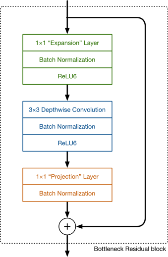
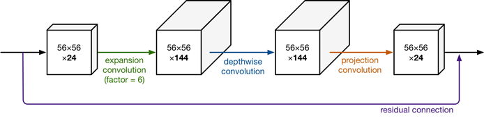

# MobileNets: Efficient Convolutional Neural Networks for Mobile Vision Applications

## Abstract
1. depth-wise separable convolutions
2. global hyperparameters

##  depth-wise separable convolutions
> 深度可分离卷积首先使用一组通道数为1的卷积核，每次只处理一个输入通道，并且这一组卷积核的个数是和输入通道数相同的。执行完上面的深度卷积后，再使用通道数为输入数据通道数大小的1 × 1的卷积来组合之前输出的特征图，将最终输出通道数变为一个指定的数量。  
> the depthwise convolution applies a single filter to each input channel. The pointwise convolution then applies a 1 1 convolution to combine the outputs the depthwise convolution. A standard convolution both filters and combines inputs into a new set of outputs in one step. The depthwise separable convolution splits this into two layers, a separate layer for filtering and a separate layer for combining.

$D_F$is spatial width and height of a square input and output feature map,   
$D_K$ is the spatial dimension of the kernel assumed to be square,   
$M$ is input channel, $N$ is output channel  

## standard convolutional layer
parameterized: $D_K$×$D_K$×M×N    
computational cost: $D_K$×$D_K$×M×N × $D_F$×$D_F$

## depth-wise separable convolutions
**depthwise convolution**
parameterized: $D_K$×$D_K$×M   
computational cost: $D_K$×$D_K$×M × $D_F$×$D_F$  
**pointwise convolution**  
parameterized: $1$×$1$×M×N      
computational cost: $1$×$1$×M×N×  $D_F$×$D_F$  

**Depthwise separable convolutions cost:**
$D_K$×$D_K$×M × $D_F$×$D_F$ + M×N×$D_F$×$D_F$

  

## Network Structure and Training
  

1. Width Multiplier: Thinner Models

2. Resolution Multiplier: Reduced Representation

# MobileNetV2: Inverted Residuals and Linear Bottlenecks

## Abstract
1. Linear Bottlenecks
2. Inverted residuals

## Problem

## Linear Bottlenecks
1. If the manifold of interest remains non-zero volume after ReLU transformation, it corresponds to a linear transformation.
2. ReLU is capable of preserving complete information about the input manifold, but only if the input manifold lies in a low-dimensional subspace of the input space.

## Inverted residuals
  
@ https://zhuanlan.zhihu.com/p/98874284
在V2的网络设计中，我们除了继续使用深度可分离（中间那个）结构之外，还使用了Expansion layer和 Projection layer。这个projection layer也是使用 $1$×$1$ 的网络结构，他的目的是希望把高维特征映射到低维空间去。另外说一句，使用 $1$×$1$ 的网络结构将高维空间映射到低纬空间的设计有的时候我们也称之为Bottleneck layer。

Expansion layer的功能正相反，使用 $1$×$1$ 的网络结构，目的是将低维空间映射到高维空间。这里Expansion有一个超参数是维度扩展几倍。可以根据实际情况来做调整的，默认值是6，也就是扩展6倍。

  

## Comparison
  

## Model Architecture

  

# 分组卷积和深度可分离卷积
@ https://zhuanlan.zhihu.com/p/65377955

