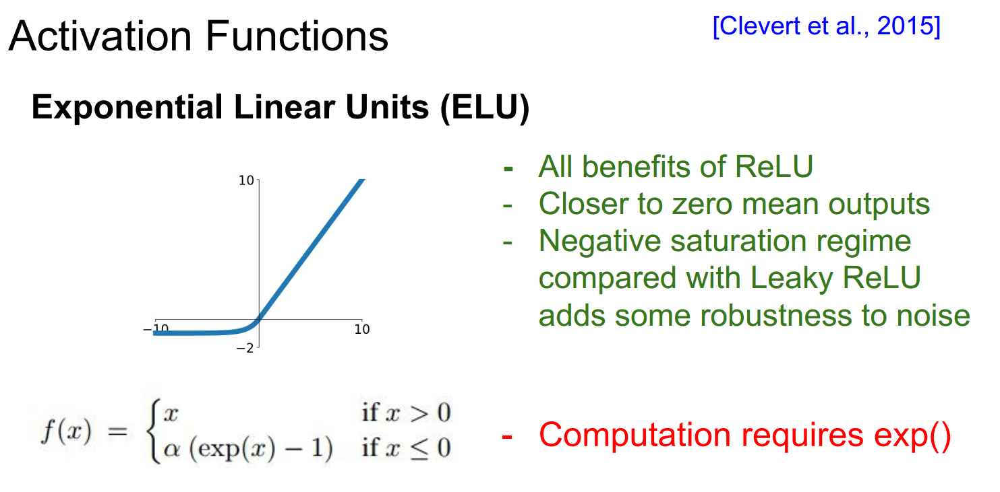

@ https://blog.csdn.net/weixin_38646522/article/details/79534677
# why the network need active functions?

# [1] Sigmoid

$$f(x) = \frac{1}{1+e^{-x}}$$

 

**优点：**
1. sigmoid函数的输出映射在（0,1）之间，单调连续，输出范围有限，优化稳定。
2. 求导容易

**缺点：**
1. 幂运算，计算成本高。
2. 导数值小于1，在两侧饱和区域容易出现梯度消失。
3. Sigmoid 函数的输出不是以零为中心的，这会导致神经网络收敛较慢。??????????

# [2] tanh

$$f(x) = \frac{1-e^{-2x}}{1+e^{-2x}}$$

 

**优点：**
1. sigmoid函数的输出映射在（0,1）之间，单调连续，输出范围有限，优化稳定。
2. 求导容易

**缺点：**
1. 幂运算，计算成本高。
2. 导数值小于1，在两侧饱和区域容易出现梯度消失。
3. 1
4. 1
5. 1
6. 

# [3] Relu

 

**优点：**
1. 可以使网络训练更快。相比于sigmoid、tanh，导数更加好求，反向传播就是不断的更新参数的过程，因为其导数不复杂形式简单。
2. 增加网络的非线性。本身为非线性函数，加入到神经网络中可以是网格拟合非线性映射。
3. 防止梯度消失。当数值过大或者过小，sigmoid，tanh的导数接近于0，relu为非饱和激活函数不存在这种现象。
4. 使网格具有稀疏性。
5. 
**缺点：**
1. ReLU的输出不是0均值的。
2. Dead ReLU Problem(神经元坏死现象)：

# [3] Leaky Relu

 

**优点：**
1. 1
2. 1
3. 1
4. 1
5. 

**缺点：**
1. 1

# [4] ELU (Exponential Linear Unit)

 

**优点：**
1. 1
2. 1
3. 1
4. 1
5. 1

**缺点：**
1. 1

# [5] SELU
$$ f(x)= \lambda		\begin{cases} \alpha(e^x-1), & \text {if $x$ < 0} \\ x, & \text{if $x$ >0} \end{cases} $$
**优点：**
1. 1
2. 1
3. 1
4. 1
5. 

**缺点：**
1. 1

# [6] Swish
$$f(x) = x*sigmoid(\beta x)$$
 
**优点：**
1. 1
2. 1
3. 1
4. 1
5. 

**缺点：**
1. 1
2. 1
3. 1
4. 1
5. 1
6. 1
7. 1
8. 1
9. 

# [7] Mish

$$Mish = x*tanh(ln(1+e^x))$$

 

 **优点：**
1. 以上无边界(即正值可以达到任何高度)避免了由于封顶而导致的饱和。理论上对负值的轻微允许允许更好的梯度流，而不是像ReLU中那样的硬零边界。
2. 平滑、非单调
3. 1
4. 1
5. 

**缺点：**
1. 计算量较大，但是效果好

